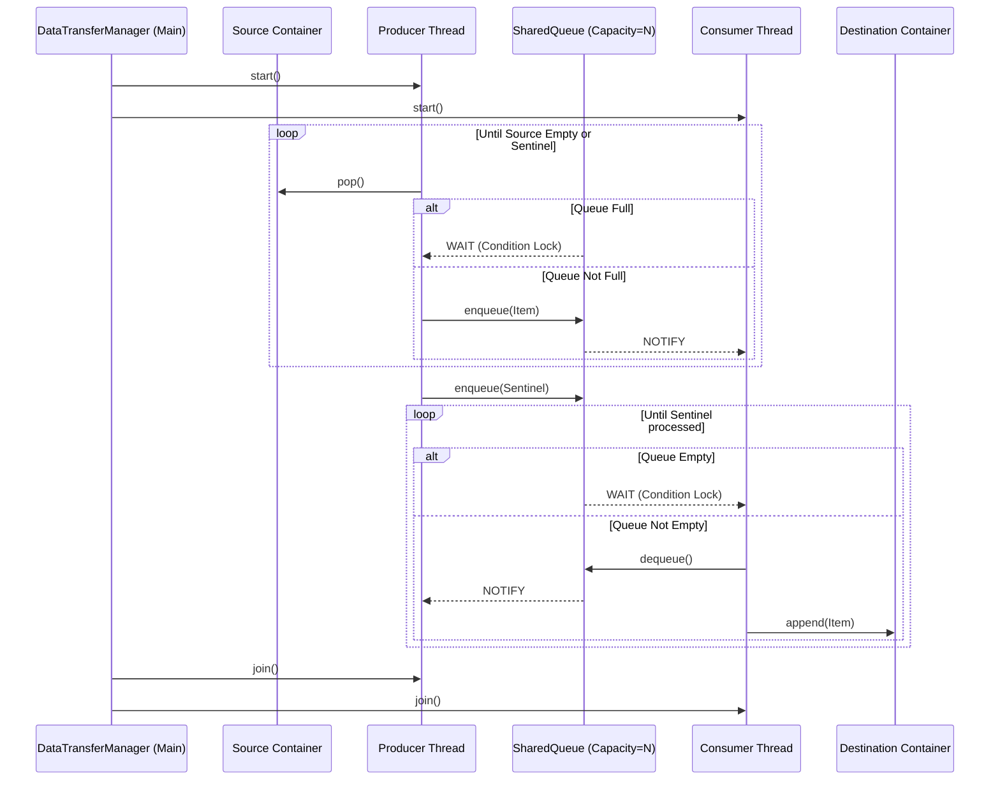

# Producer-Consumer Data Transfer System

## Overview

This application demonstrates a classic threading synchronization problem solving resilient data transfer strategies. It simulates transferring discrete payload `Items` originating from a source container synchronously across a size-limited `SharedQueue` and ultimately into a destination container.

The architecture strictly utilizes core Python `threading` capacities—specifically primitive locks (`threading.Lock`) and condition triggers (`threading.Condition`)—to orchestrate robust inter-thread communication securely handling dynamic capacities and network delays natively without depending on high-level standard library abstractions like `queue.Queue`.

## Architecture Component Definitions

- **Item (`models.py`)**: Immutable dataclass containing `id`, `data`, and initialized `timestamp` mappings.
- **SharedQueue (`shared_queue.py`)**: Thread-safe FIFO bounding queue manually orchestrating concurrency via blocking condition wait/notify events instead of `queue.Queue`.
- **Producer (`producer.py`)**: Dedicated extraction thread. Extracts items from `source` container enqueuing them onto the `SharedQueue` safely or yields if capacity maxed.
- **Consumer (`consumer.py`)**: Dedicated processing thread. Extracts items natively from the `SharedQueue` writing sequentially into the `destination` memory bank, waiting natively if queue is empty.
- **DataTransferManager (`manager.py`)**: Higher-order API. Handles complex lifecycle operations abstracting thread generation, monitoring queue bounds limits via `.get_queue_status()`, and invoking graceful `.stop_transfer()` triggers.

### Threading Architecture Diagram



## Data Structure

Items are passed between threads as structured, immutable `dataclass` objects:

```python
@dataclass(frozen=True)
class Item:
    id: int
    data: str
    timestamp: float = field(default_factory=time.time)
```

## Setup & Configuration

**All module and testing dependencies are managed gracefully and listed within the `pyproject.toml` definition file.** Ensure Python `^3.9` is actively installed locally prior to usage.

### Installation

1. Create a logical Virtual Environment within the `.intuit/producer_consumer` project directory:

   ```bash
   python -m venv venv
   source venv/bin/activate  # Unix/macOS
   # On Windows typically: .\venv\Scripts\activate
   ```

2. Install the necessary development and runtime dependencies parsed from `.toml`:

   ```bash
   pip install -e .
   ```

3. Setup environment bounds automatically utilizing the `.env` root file:
   ```env
   NUM_ITEMS=25
   QUEUE_CAPACITY=5
   LOG_LEVEL=INFO
   ```

## Execution Interfaces

The executable `intuit_producer_consumer` module has been explicitly tied to `main.py` entrypoint. Application logs naturally cascade gracefully into `output/application.log`.

**Standard Data Transfer**
To execute the application orchestrator showcasing the simulated Producer/Consumer behaviors:

```bash
python -m src.intuit_producer_consumer.main
```

**Automated Test Integration Check**
To natively run the complete functional edge tests directly through the main entry proxy using Argparse hooks without relying on direct pytest invocation:

```bash
python -m src.intuit_producer_consumer.main --run-tests
```

_Note: Granular test outputs automatically generate specific local files under `output/<module_name>.log` thanks to custom `conftest.py` bindings._

## Test Coverage

The application features a comprehensive `pytest` suite simulating rigorous edge-cases and boundary conditions natively. Key test coverage includes:

1. **Thread Synchronization & Locks**: Validates `SharedQueue` blocking when full/empty, strictly enforcing capacity constraints.
2. **Data Integrity & FIFO Order**: Asserts items are processed sequentially without corruption across massive concurrent payloads.
3. **Graceful Shutdown Heuristics**: Verifies sentinels cleanly terminate consumer threads without deadlocks.
4. **Timeout Handling**: Ensures the orchestrator aggressively halts stalled threads during forced latency bounds.

## Key Demonstrated Concepts

- **Race Condition Prevention**: Shared queue access uses `Lock` ensuring mutual exclusion.
- **Deadlock Avoidance**: Proper use of `Condition` properties (`wait()` / `notify_all()`) natively releasing locks.
- **Graceful Thread Shutdown Heuristics**: Sentinel injections correctly terminate listeners preventing zombie endpoints.
- **Performance Testing**: Designed to force concurrent locks explicitly utilizing timeouts.
