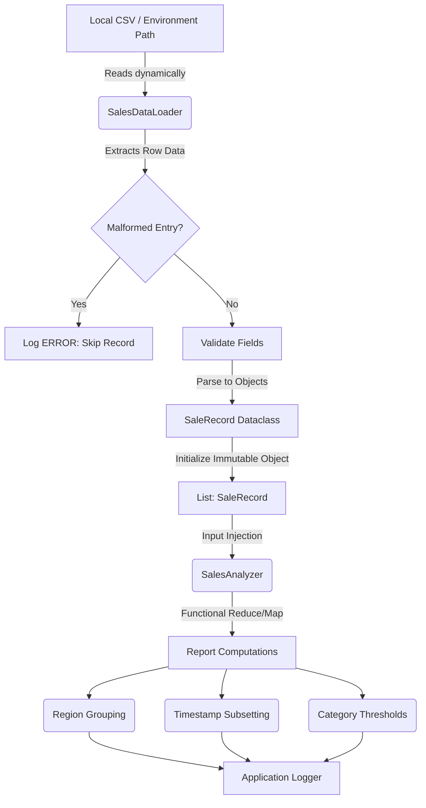

# Sales Analytics Application

## Overview

This application processes tabular `.csv` transaction dumps mapping raw historical string limits into mathematically verifiable models cleanly avoiding imperative side-effects entirely.

Data is instantiated into strictly immutable types (`dataclasses`), preserving states securely across analysis pipelines naturally imitating map-reduce algorithms.

## Dataset Description

### CSV Structure

The analysis engine parses standardized sales streams formatted precisely:

| Column           | Type    | Description                           |
| ---------------- | ------- | ------------------------------------- |
| transaction_id   | String  | Unique transaction identifier         |
| date             | String  | Order execution boundary (YYYY-MM-DD) |
| region           | String  | Demographic location limits           |
| salesperson      | String  | Salesperson responsible               |
| product_category | String  | Item category string                  |
| quantity         | Integer | Positive units bounded                |
| unit_price       | Float   | Non-negative price constraints        |

### Data Validation Rules

All payloads implicitly resolve specific bounds:

- **Missing Elements**: Safely isolated as parse errors isolating the pipeline.
- **Malformed Datatypes**: Automatically rejected (e.g., catching integers on strings).

## Architecture Component Definitions

- **SaleRecord (`models.py`)**: Defines an explicit `dataclass(frozen=True)` bounding variables into static attributes directly matching configuration schema fields.
- **SalesDataLoader (`data_loader.py`)**: Abstract initialization generator. Validates internal row parameters streaming dynamically through missing files/malformed datatypes safely pushing clean records up structurally bypassing errors individually.
- **SalesAnalyzer (`analyzer.py`)**: Implements strict functional programming techniques using `map()`, `filter()`, `reduce()`, and `itertools.groupby()` resolving core statistical requirements:
  1. Overall aggregation (Total, Count, Min, Max bounds)
  2. Date/Index reduction structures (Time-based boundaries)
  3. Category slicing and threshold aggregation bounds
- **main.py**: Orchestrates dynamic Data Loading and applies analytic reductions dynamically routing logs visually locally inside pipelines.

### Flow Architecture Diagram



## Setup & Configuration

**All module and testing dependencies are managed gracefully and listed within the `pyproject.toml` definition file.** Ensure Python `^3.9` is actively installed locally prior to usage.

### Installation

1. Create a logical Virtual Environment within the `.intuit/sales_analytics` project directory:

   ```bash
   python -m venv venv
   source venv/bin/activate  # Unix/macOS
   # On Windows typically: .\venv\Scripts\activate
   ```

2. Install the necessary development and runtime dependencies seamlessly handling explicit path traversals via `.toml`:

   ```bash
   pip install -e .
   ```

3. Setup environment mapping utilizing the `.env` root file. _(Note: CSV generator natively injects missing test payloads to mapped limits.)_
   ```env
   CSV_FILE_PATH=data/sample_sales.csv
   LOG_LEVEL=INFO
   ```

## Execution Interfaces

The executable `intuit_sales_analytics` module has been tightly bounded to `main.py` entrypoint. Application logs cascade gracefully into `output/application.log`.

**Standard Data Transfer**
To execute the application orchestrator traversing the CSV datasets:

```bash
python -m src.intuit_sales_analytics.main
```

**Automated Test Integration Check**
To natively run the complete functional edge tests directly through the main entry proxy using Argparse hooks alongside custom `conftest.py` boundaries:

```bash
python -m src.intuit_sales_analytics.main --run-tests
```

_Note: Results identically mimic `output/test_results.log`, formatting granular results (`✓ PASSED`) safely under internal `output/<test_module_name>.log` structures._

## Test Coverage

The application features a robust `pytest` suite validating the functional reduction pipelines and data loading bounds. Key test coverage includes:

1. **Malformed Data Handling**: Ensures `SalesDataLoader` safely drops corrupted CSV rows (e.g., negative prices, invalid dates) while logging warnings instead of crashing.
2. **Missing File Exceptions**: Verifies `FileNotFoundError` mappings correctly bubble up during initialization.
3. **Empty Dataset Resiliency**: Asserts that operations safely bypass zero-division errors when generating metrics on empty collections.
4. **Functional Reduction Accuracy**: Strictly verifies mathematical precision for all `total`, `average`, `groupby`, and `date-range` mapped subsets.

## Key Demonstrated Concepts

- **Pure Functions**: Analysis constraints generate identical aggregations cleanly decoupled from mutations.
- **Lazy Evaluation**: Streaming inputs via `generators` minimizing memory loads per chunk.
- **Immutability Principles**: Native implementations bounded via configuration `dataclasses`.
- **Itertools Aggregation Constraints**: Leveraging `groupby` to mimic lambda subset mapping.
- **Map-Reduce Tooling**: Leveraging explicit standard library primitives.
